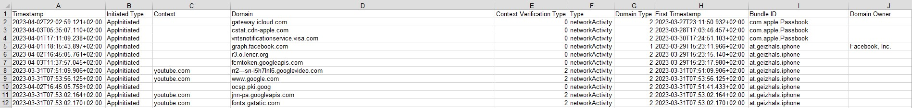

# Apple-Privacy-Report-Converter
## Easy Way to block In-App-Ads with Apple Privacy Report - Made for PiHole

### Export a Privacy Report on your iPhone:
Open the Settings app on your iPhone.\
Scroll down and tap on "Privacy & Security".\
Scroll down and tap on "App Privacy Report".\
Tap on "Share".\
Choose a location to save the report (e.g. Files, Notes, etc.).\
The report will be saved as a CSV file that you can open and view on your device or computer.

### Convert NDJSON to CSV:
Copy ndjson_to_csv.php on your Webserver\
Browse to yourdomain.com/yourfolder/ndjson_to_csv.php\
Upload App_Privacy_Report_vX_XXXX-XX-XXXXX_XX_XX.ndjson with the HTML Form shown on the Page\
Open the ndjson.csv file and search for the domain/app you want to block on your PiHole

### Convert NDJSON to PiHole BlockList:
Copy ndjson_to_pihole_blocklist.php on your Webserver\
Browse to yourdomain.com/yourfolder/ndjson_to_pihole_blocklist.php\
Upload App_Privacy_Report_vX_XXXX-XX-XXXXX_XX_XX.ndjson with the HTML Form shown on the Page\
Open the blocklist.txt file and search for the domain/app you want to block on your PiHole

### How it works:
This is a PHP script that converts NDJSON (Newline Delimited JSON) data to CSV (Comma Separated Values) format.\
It first checks if an NDJSON file is uploaded via a form and if there are no errors in the upload.\
It then reads the NDJSON file line by line, converts each line to a JSON object, and if the object has the necessary keys,\
it adds the corresponding values to a multidimensional array.\
Finally, it outputs the data in CSV format by setting the appropriate headers and using the fputcsv() function to write the data to the output stream.\
If no file is uploaded or there is an error in the upload, it displays an HTML form for file upload.

### Please keep in mind:
This PHP script is not secure enough to run on public instances due to security vulnerabilities. It is important to ensure that the script has proper input validation and error handling to prevent malicious attacks such as SQL injection or cross-site scripting (XSS). Additionally, it is recommended to use the latest version of PHP and keep the script updated with security patches. Failure to do so could leave your application open to potential security risks and compromise sensitive data.
